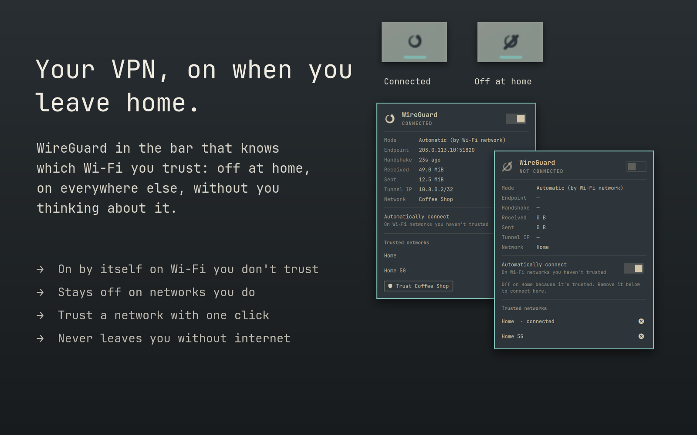
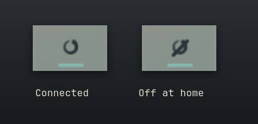
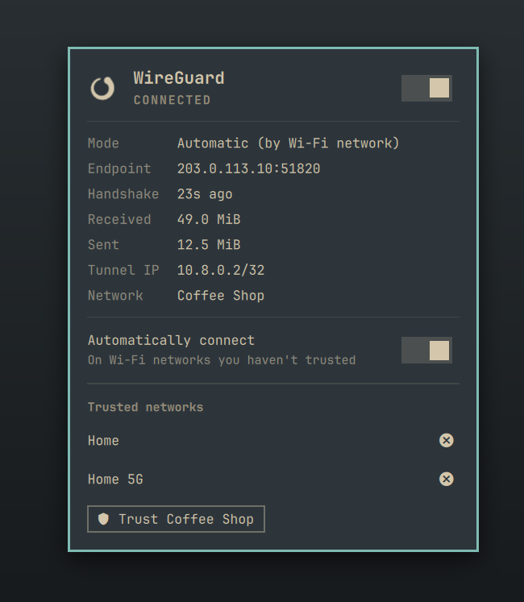
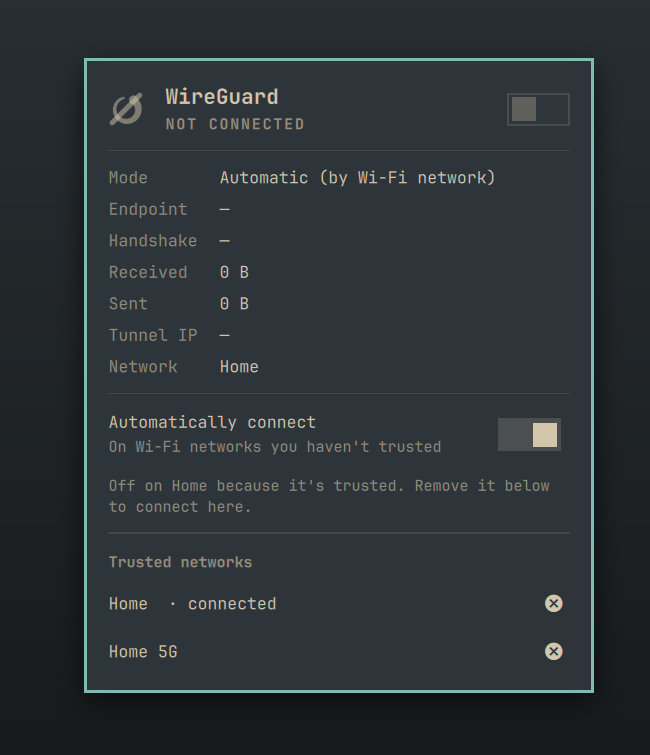
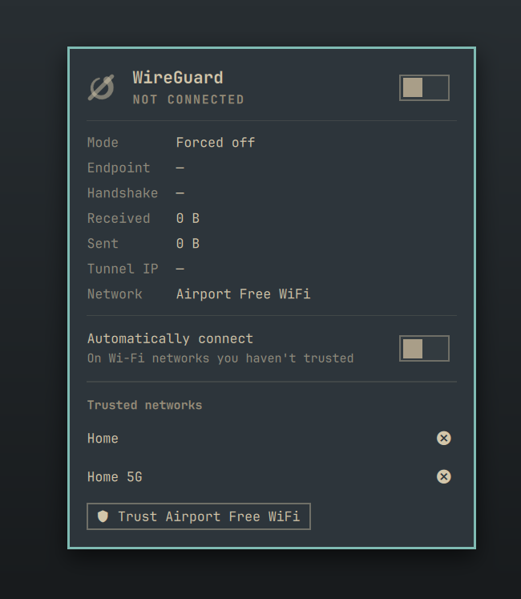

# WireGuard — an Omarchy bar widget

Your VPN, on when you leave home. WireGuard in the bar that knows which Wi-Fi
you trust, and does the right thing on its own.



## What you get

A VPN you have to remember to turn on is a VPN that's off when it matters.
This one follows your Wi-Fi instead. Tell it once which networks you trust,
like home or the office, and it takes care of the rest.

**It turns itself on.** Join a café, airport or hotel network and the tunnel
comes up by itself. The icon in the bar tells you it's connected, and the
panel shows the live speed, the last handshake and where you're connected to.





**And off when you're home.** On a network you trust it stays down, and the
panel says why. That matters, because tunnelling home from inside your own
network is exactly what most home routers can't do.



**Trust a network in one click.** Your trusted networks are listed right in
the panel. **Trust <network>** adds the one you're on, and ⊗ removes one.

**You can always override it.** Flip the switch to force it on or off, or turn
off *Automatically connect* to take manual control. Either way, it never fights
you.



**It never leaves you without internet.** If the tunnel comes up but the other
end never answers, it's torn back down after 10 seconds, instead of quietly
swallowing all your traffic.

**Honest about what it touches.** A small, readable installer sets up the
parts that need root. It installs everything under this plugin's own names and
records exactly what it installed, so uninstalling removes just that. The one
file it never touches is your WireGuard key.

Installs as the bar widget `blacksheep.wireguard`.

## What you need

- A WireGuard server and a client config for this machine, `/etc/wireguard/wg0.conf`.
  Many home routers (UniFi, OPNsense, pfSense, Fritz!Box) export one.
  [`system/examples/wg0.conf.example`](system/examples/wg0.conf.example) shows
  the shape. Give each machine its own keypair.
- NetworkManager, which Omarchy uses already.

## Install

The widget is only the UI. Switching the tunnel and following your Wi-Fi need
root, so a small privileged half ships in `system/` and `install.sh` puts it in
place. Read it first: it is short, and every file it installs is listed at the
top.

```bash
# 1. The widget
omarchy plugin add https://github.com/jonspinks/omarchy-wireguard --enable

# 2. Its privileged half. Asks for your trusted Wi-Fi networks: at least the
#    one your VPN server is on.
~/.config/omarchy/plugins/blacksheep.wireguard/install.sh

# 3. Your tunnel config, if it isn't there yet
sudo install -o root -g root -m 0600 wg0.conf /etc/wireguard/wg0.conf

omarchy restart shell
```

`install.sh --check` reports what is in place and changes nothing.

## Update

```bash
omarchy plugin update blacksheep.wireguard
~/.config/omarchy/plugins/blacksheep.wireguard/install.sh   # refresh the root-owned copies
```

`install.sh --check` says when an installed script differs from the plugin's.

## Remove

```bash
~/.config/omarchy/plugins/blacksheep.wireguard/install.sh --uninstall
omarchy plugin remove blacksheep.wireguard
omarchy restart shell
```

`--uninstall` brings the tunnel down if this widget raised it, and removes
every file `install.sh` put in place that is still as it installed it. It leaves `/etc/blacksheep.wireguard/trusted`, `/etc/wireguard/wg0.conf` and the
`wireguard-tools` package, because those are yours; it prints how to remove them.

## How it works

`90-blacksheep-wireguard`, a NetworkManager dispatcher script, runs on every network
change. It decides up or down from the current SSID and hands off to
`wg-ssid-apply` through a transient `systemd-run` unit: the apply script waits
up to 10 s for a handshake, and a dispatcher that blocks that long stalls
NetworkManager's queue for everything else.

**Trusted networks run bare.** Usually that means the network your VPN server is
on: connecting from inside it asks the router to hairpin its own public address,
which most home routers cannot do, so the handshake never lands.

`wg-ssid-apply` refuses to strand the machine. A tunnel whose handshake never
arrives still owns its routes and blackholes traffic, so after 10 s with no
handshake it tears the tunnel back down, including one that was forced on.

`wg-toggle` is the manual override the panel calls (`toggle`, `on`, `off`,
`auto`), stored in `/var/lib/blacksheep.wireguard/override`. A manual choice outranks the
Wi-Fi policy in both directions; `auto` hands the decision back.

The panel's **Trusted networks** section lists the networks, removes one with
its ⊗ button, and **Trust <network>** (key `t`) adds the network you are on.
Changes apply at once in automatic mode; a forced on or off is left alone. The
list is `/etc/blacksheep.wireguard/trusted`, one SSID per line, and `sudoedit` works too.
**An empty list means no network is trusted**, so the tunnel comes up on every
Wi-Fi network: the safe default for a VPN.

## Privilege model

The bar runs as you. It reads state from world-readable files
(`/var/lib/blacksheep.wireguard/override`, `/run/blacksheep.wireguard/last-result`,
`/sys/class/net/wg0/statistics/`) through `scripts/wireguard-stats`, which runs
from the plugin folder as a fixed command.

Everything that needs root goes through one `sudoers` drop-in,
[`system/sudoers.d/99-blacksheep-wireguard`](system/sudoers.d/99-blacksheep-wireguard), which lists
every command with its exact arguments and has **no wildcards**:

- `wg-toggle toggle|on|off|auto` — switch the tunnel.
- `wg-toggle trust` — takes no name, so it can only add the network the machine
  is connected to. Nothing can quietly trust an arbitrary network.
- `wg-toggle untrust` — reads the one name from stdin, not argv, and deletes
  only an exact existing entry. The worst a misuse can do is make the tunnel
  come up *more* often.
- `wg show wg0 latest-handshakes|endpoints|transfer` — read-only status. It
  never prints the private key.

The scripts it grants are installed root-owned in
`/usr/local/libexec/blacksheep.wireguard`, never run
from the plugin folder, so nothing you can write is ever run as root. They keep
their state and locks in root-owned directories, never in a shared temporary
one. `install.sh` fills in your account name, validates the drop-in with
`visudo -c` in a temporary location and only then moves it into place: a
sudoers file that does not parse locks sudo out entirely.

The drop-in is named `99-` because sudo applies the **last** matching rule, so a
blanket `%wheel ALL=(ALL:ALL) ALL` sorting after it would bring the password
prompt back.

## What it owns

Everything `install.sh` installs is under a name that belongs to this plugin
(`blacksheep.wireguard` / `blacksheep-wireguard`), and it records a SHA-256 of every
file it installs in `/var/lib/blacksheep.wireguard/installed`.

- **Install** replaces a file only if it is absent, is the plugin's own
  recorded copy unchanged, or is already byte-identical to what it would
  install. Anything else stops the install before it changes a thing, and
  names the file.
- **Uninstall** removes only files that still match their record. A file
  changed since install is left in place and reported. Without a record it
  removes nothing: it never guesses from a file name.
- **The tunnel.** `wg-ssid-apply` records the kernel interface index of the
  `wg0` it raises. The automatic policy, and `--uninstall`, only take down that
  `wg0`; a tunnel brought up any other way has a different index and is left
  alone. Turning the tunnel off in the panel is your explicit choice, so it
  downs any `wg0`. Don't also enable `wg-quick@wg0.service`: `install.sh
  --check` warns if it is.

## License

MIT — see [LICENSE](LICENSE).
